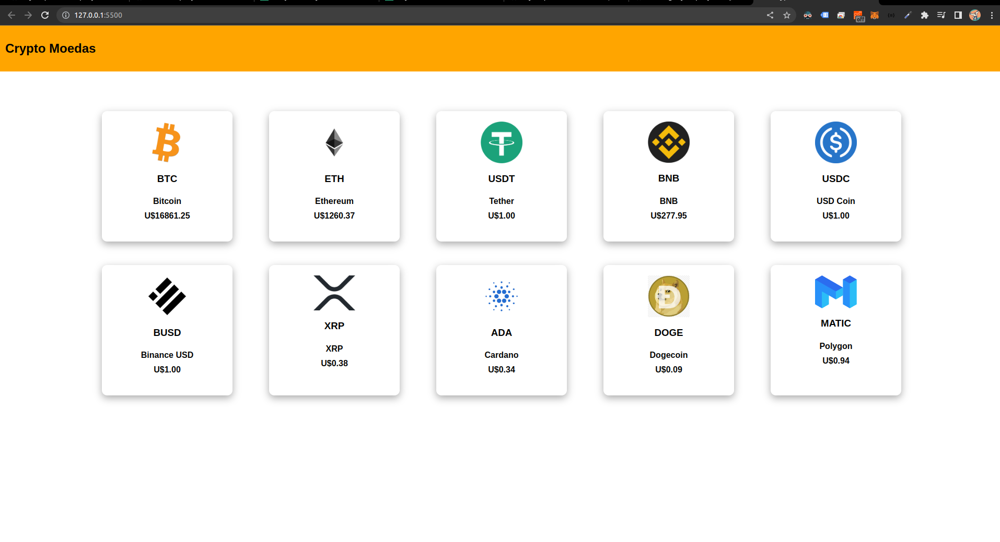

# Boas vindas ao projeto JavaScrypt Async!
  Projeto individual durante o curso de desenvolvimento web na trybe.

  Esse projeto foi feito para praticar habilidades de requisição e manipulação de dados de APIs.

## Habilidades
- Criação de elementos através do javaScript;

- Requisição e manipulação de dados de APIs;

- CSS Flexbox;

## Veja o resultado a seguir do projeto pronto:
  

## Requisitos Obrigatorios:

    ✅ 1. Vamos consultar uma `API` que fornece os valores de crypto moedas.

    ✅ 2. Agora, vamos fazer com que as moedas apareçam na tela.

    ✅ 3. Mostrando somente as 10 primeiras moedas da requisição.

